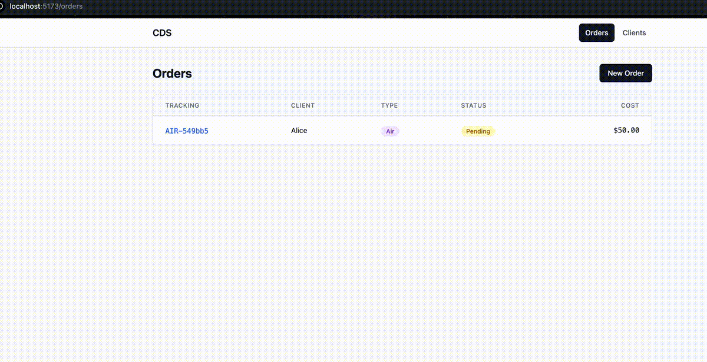

# CDS - Common Delivery System

Full-stack delivery management app. Factory Method pattern for delivery strategies (Water, Land, Air), REST API, React SPA.



## Stack

**Backend:** PHP 8.3, PostgreSQL 16, FastRoute, PHPUnit 10, phpstan level 6
**Frontend:** React 18, TypeScript, Vite, Tailwind CSS, Framer Motion, React Query, Vitest + MSW
**Infra:** Docker Compose (nginx, php-fpm, postgres, node)

## Quick Start

```bash
make build
```

Open http://localhost:5173

## API

| Method | Endpoint | Description |
|--------|----------|-------------|
| GET | /api/clients | List clients |
| POST | /api/clients | Create client |
| GET | /api/clients/:id | Get client |
| DELETE | /api/clients/:id | Delete client |
| GET | /api/orders | List orders |
| POST | /api/orders | Create order |
| GET | /api/orders/:id | Get order |

Error envelope: `{ "error": { "code": string, "message": string, "status": int } }`

## Commands

| Command | Description |
|---------|-------------|
| `make build` | Build, install deps, migrate — full setup |
| `make up` | Start all services |
| `make down` | Stop all services |
| `make install` | Install PHP dependencies |
| `make install-frontend` | Install frontend dependencies |
| `make migrate` | Run database migrations |
| `make test` | Run backend tests (PHPUnit) |
| `make test-frontend` | Run frontend tests (Vitest) |
| `make lint` | Run php-cs-fixer |
| `make analyse` | Run phpstan |
